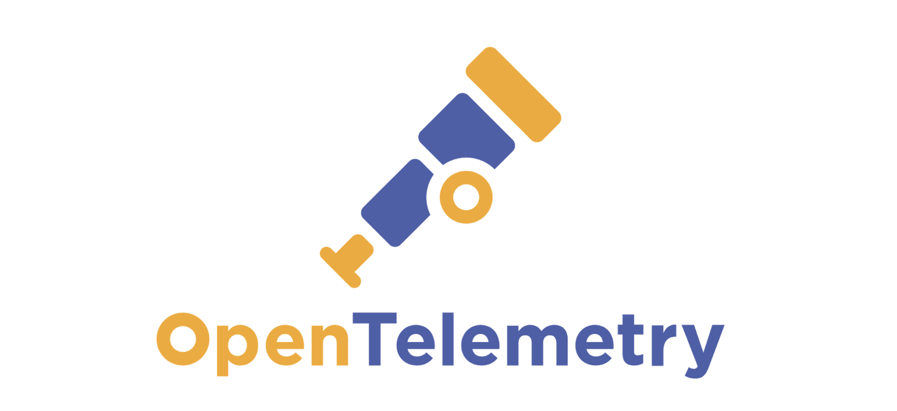

<h1>OpenTelemetry Demo</h1>



This repo provides a straightforward illustration of using Open Telemetry with a set of microservices,
backed by Kafka and a Postgres DB.

For more information on the OpenTelemetry project, please refer to [here](https://opentelemetry.io/docs/).

# Tech Stack

The components used to provide the OpenTelemetry implementation are:

- Alloy - https://grafana.com/docs/alloy/latest/
- Loki - https://grafana.com/docs/loki/latest/
- Tempo - https://grafana.com/docs/tempo/latest/
- Grafana - https://grafana.com/docs/grafana/latest/

The data stack comprises:

- PostgreSQL - https://www.postgresql.org/
- Redis - https://redis.io/ 
- Apache Kafka - https://kafka.apache.org/ 

The microservices are built using:

- NestJS - https://nestjs.com/
- Prisma - https://www.prisma.io/
- BullMQ - https://docs.bullmq.io/

# Running the project

All required components and services can be built and run using Docker.

```shell
docker compose up -d
```


